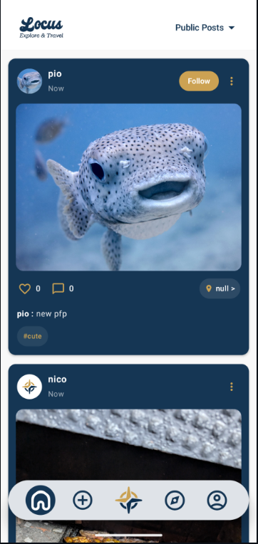
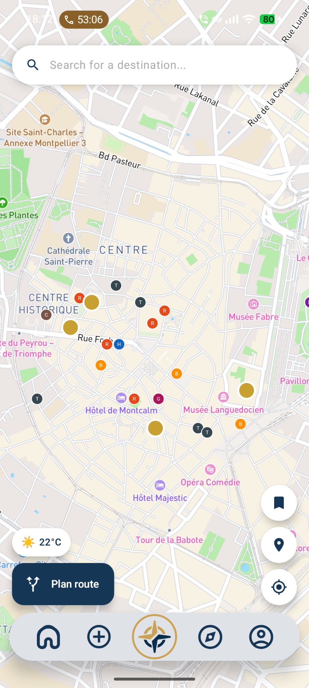
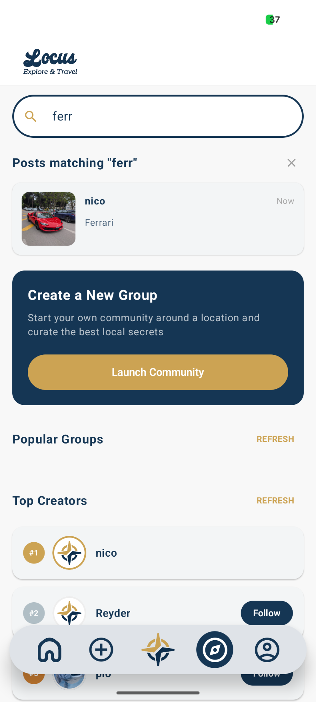
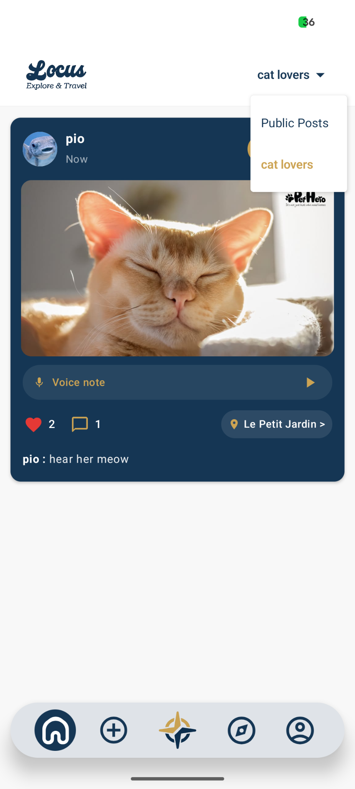
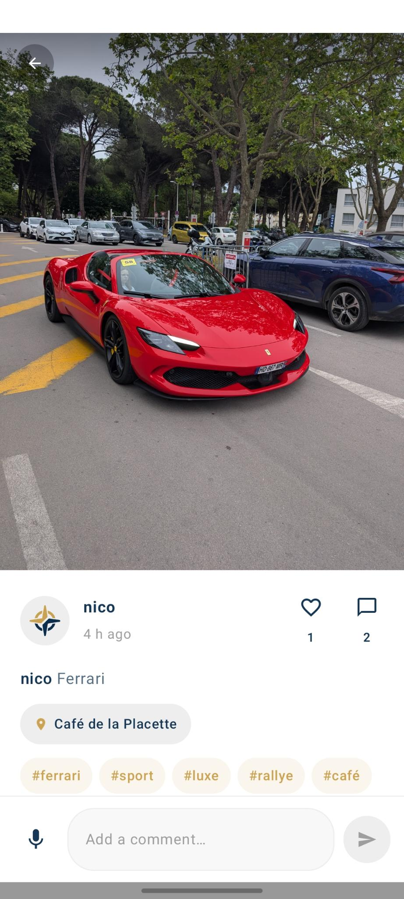
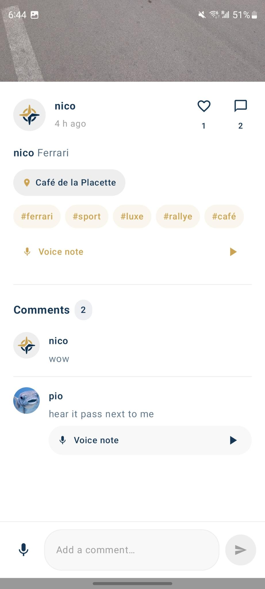
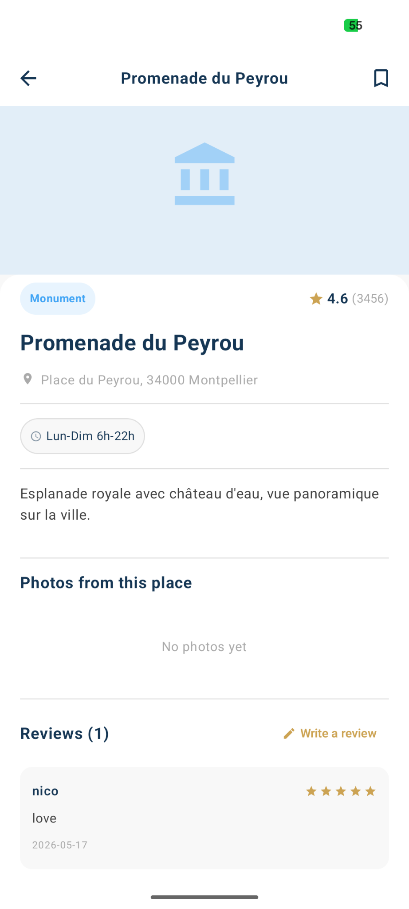
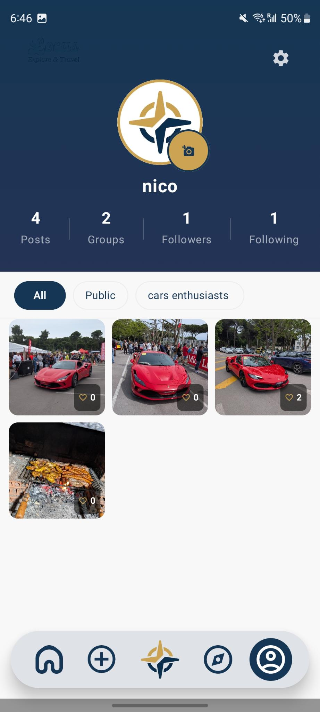
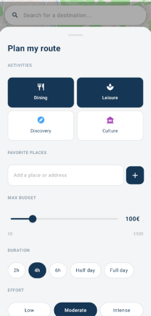
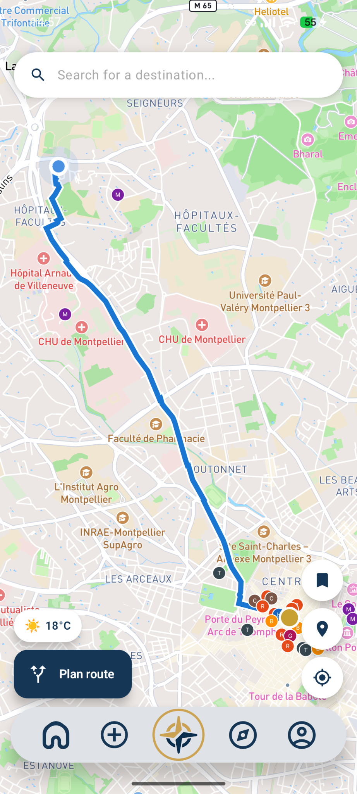

# Locus

<p align="center">
  
</p>

<p align="center">
  <b>Partagez vos lieux. Explorez le monde.</b>
</p>

<p align="center">
  
  
  
  
  
</p>

---

Locus est une application Android qui fusionne le partage de photos de voyage et la planification intelligente d'itinéraires dans une interface centrée sur la carte. Deux modules coexistent : **TravelShare** pour publier et découvrir des photos géolocalisées, et **TravelPath** pour générer des parcours de visite personnalisés.

## Stack technique

| Couche | Technologie |
|--------|-------------|
| Backend | Go 1.26 + `net/http` |
| Base de données | PostgreSQL 16 (POINT, JSONB, TEXT[]) |
| Frontend | Kotlin + Jetpack Compose |
| Carte | Mapbox Maps SDK 11.9 |
| IA | Gemini 2.5 Flash (auto-tagging) |
| Météo | OpenWeatherMap API |
| Notifications | Firebase Cloud Messaging |
| Déploiement | Docker + docker-compose |

## Fonctionnalités

**TravelShare**
- Mode anonyme et connecté avec authentification JWT
- Publication de photos et d'enregistrements audio géolocalisés
- Auto-tagging des publications par intelligence artificielle (Gemini)
- Recherche multicritères : texte, tags, position GPS + rayon
- Groupes publics et privés, follow/unfollow
- Likes avec debounce, commentaires audio, signalement de contenu
- Notifications push Firebase en temps réel

**TravelPath**
- Génération de 3 itinéraires personnalisés simultanément (économique, équilibré, confort)
- Prise en compte de la météo, du budget, de la durée et du niveau d'effort
- Navigation pas-à-pas via Mapbox Directions
- Export PDF et partage d'itinéraire par URL publique
- Avis et notes sur les lieux (1 à 5)

## Lancer le projet

### Backend

```bash
cp .env.example .env
# Renseigner GEMINI_API_KEY, OPENWEATHER_API_KEY
docker compose up --build -d
```

### Frontend

Dans `local.properties` :
```
MAPBOX_PUBLIC_TOKEN=your_token
API_BASE_URL=http://your_server:8080/
```

Puis ouvrir le projet dans Android Studio et lancer sur un émulateur ou appareil physique.

## Aperçu

<p align="center">
  
  &nbsp;&nbsp;
  
  &nbsp;&nbsp;
  
  &nbsp;&nbsp;
  
</p>
<p align="center">
  
  &nbsp;&nbsp;
  
  &nbsp;&nbsp;
  
  &nbsp;&nbsp;
  
</p>
<p align="center">
  
  &nbsp;&nbsp;
  
</p>

---

<p align="center">REY Dorian · BASILE Francesco-Pio · 2026</p>
